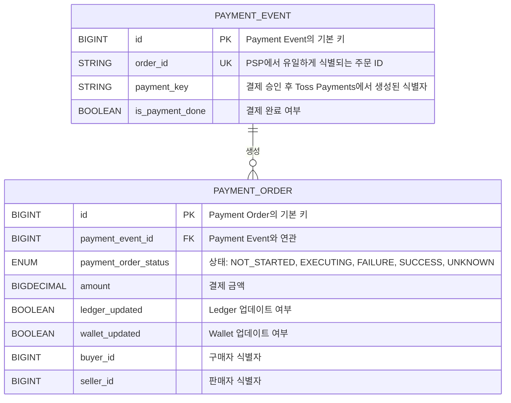
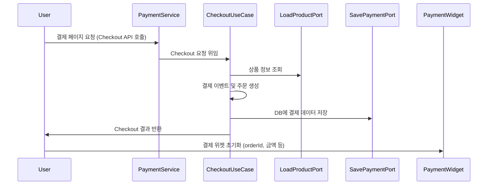

# 견고한 결제 서비스
#### 목차

1. [요구사항 개요](#1-요구사항-개요)
2. [결제 시스템 아키텍처: 기술 및 선택 근거](#2결제-시스템-아키텍처-기술-및-선택-근거)
   - [2.1 Payment Service](#21-payment-service)
   - [2.2 Payment Event 와 Payment Order](#22-payment-event-와-payment-order)
     - [Payment Event](#payment-event)
     - [Payment Order](#payment-order)
   - [2.3 데이터 저장소](#23-데이터-저장소)
   - [2.4 아키텍처 스타일: MSA](#24-아키텍처-스타일-msa-microservices-architecture)
   - [2.5 동기식 vs 비동기식 통신 & Webflux 활용](#25-동기식-vs-비동기식-통신--webflux-활용)
     - [동기식 통신](#동기식-통신)
     - [비동기식 통신](#비동기식-통신)
     - [Webflux (논블로킹)](#webflux-논블로킹)
   - [2.6 멱등성 (Idempotency) 처리](#26-멱등성-idempotency-처리)
   - [2.7 데이터 일관성과 트랜잭션 처리](#27-데이터-일관성과-트랜잭션-처리)
   - [2.8 메시지 전송 보장 및 이벤트 처리](#28-메시지-전송-보장-및-이벤트-처리)
3. [결제 워크플로우](#3-결제-워크플로우)
   - [3.1 Checkout 프로세스](#31-checkout-프로세스)
   - [3.2 Checkout 시퀀스 다이어그램](#32-checkout-시퀀스-다이어그램)
   - [3.3 결제 승인 프로세스](#33-결제-승인-프로세스)
   - [3.4 결제 복구 프로세스](#34-결제-복구-프로세스)
4. [사용 기술](#4-사용-기술)
5. [개발환경](#5-개발환경)

## 1. 요구사항 개요
- **결제 옵션**: Toss Payments 단일 사용
- **서비스 지역**: 대한민국 한정
- **트래픽**: 월 약 1,000,000건 (초당 10건 이상)
- **핵심 요구사항**:
  - **신뢰성(Reliability) 및 장애 허용성(Fault Tolerance)**
  - **결제 데이터 일관성(Consistency) 보장**
  - **결제 프로세스**: 구매자가 결제를 진행하고, 이커머스 법인 계좌로 이체되는 과정 구현
- **보안 및 사용자 인증**: 요구사항에서 생략

---

# 2.결제 시스템 아키텍처: 기술 및 선택 근거

### 2.1 Payment Service
**Payment Service** 는 사용자가 결제를 시작하여 결제가 최종 승인되기까지의 전체 과정을 관리합니다.  
주요 역할은 다음과 같습니다.
- **역할**
  - 결제 시작부터 완료까지 전체 프로세스를 총괄
  - 결제 처리, 상태 변경, 최종 완료 처리
- **선택 이유**
  - 중앙 집중식으로 결제 흐름을 관리하여 전체 과정의 일관성 및 추적 용이
  - 사용자 요청에 대해 즉각적인 응답(동기식 처리) 제공

---

### 2.2 Payment Event 와 Payment Order

#### Payment Event
- **역할**
  - Checkout 과정에서 생성되어 결제 진행의 시작점 역할
  - PSP와의 연동(조회, 취소 등)에 필요한 식별 정보 제공
- **주요 필드**
  - `id`: Payment Event 식별자
  - `order_id`: PSP에서 결제 주문 유일 식별자
  - `payment_key`: 결제 승인 후 생성된 식별자
  - `is_payment_done`: 결제 완료 여부
- **선택 이유**
  - 결제 상태 추적 및 PSP 연동 시 고유 식별자 제공을 통해 관리 용이

#### Payment Order
- **역할**
  - 실제 결제 대상(상품)에 대한 정보 관리
  - 결제 상태, 금액, Ledger 및 Wallet 업데이트 여부 등 세부 정보 관리
- **주요 필드**
  - `id`: Payment Order 식별자
  - `payment_event_id`: Payment Event와의 관계
  - `payment_order_status`: 결제 승인 상태 (NOT_STARTED, EXECUTING, FAILURE, SUCCESS, UNKNOWN 등)
  - `amount`: 결제 금액
  - `ledger_updated`: Ledger에 기록 여부
  - `wallet_updated`: Wallet에 정산 처리 여부
  - `buyer_id`: 구매자 식별자
  - `seller_id`: 판매자 식별자
- **선택 이유**
  - 각 결제의 세부 정보를 별도로 관리하여, 후속 보상 처리나 재시도 로직 구현에 용이

> **참고:** 이 프로젝트는 결제 이벤트 생성, 결제 승인, 오류 처리 및 복구 등 결제 전 과정을 관리합니다.  
> Wallet 및 Ledger 서비스 관련 내용은 포함하지 않습니다.

Payment Service의 핵심 데이터 모델은 **Payment Event**와 **Payment Order**로 구성됩니다.

---

## 2.3 데이터 저장소

### RDBMS 선택
- **선택 이유**
  - ACID 트랜잭션과 일관성 보장이 필수인 금융 거래 데이터에 적합
  - 데이터베이스의 성숙도와 안정성을 통한 신뢰성 확보
  - 확장성도 제공 가능하지만, 데이터 일관성과 무결성을 최우선으로 고려

---

## 2.4 아키텍처 스타일: MSA (Microservices Architecture)
- **선택 이유**
  - Ledger, Wallet 등 개별 서비스 장애가 전체 시스템에 영향을 미치지 않도록 SPOF(단일 실패점)를 제거
  - 각 서비스의 독립적 배포와 확장을 통해 신뢰성과 장애 허용성 강화

---

## 2.5 동기식 vs 비동기식 통신 & Webflux 활용

### 동기식 통신
- **적용 부문**
  - 사용자의 결제 요청 처리
- **선택 이유**
  - 즉각적인 응답이 필요하므로 동기식 호출로 사용자 경험 보장

### 비동기식 통신
- **적용 부문**
  - PSP 결제 승인 후, 후속 처리(장부 기록, 정산 처리 등)
- **선택 이유**
  - 사용자에게는 이미 응답이 완료된 후 내부 처리를 비동기식으로 처리하여, 결합도 낮추고 성능 및 확장성 향상

### Webflux (논블로킹)
- **적용 부문**
  - Payment Service에서 Ledger, Wallet Service와의 통신
- **선택 이유**
  - 높은 TPS 처리에 적합한 논블로킹 방식으로 시스템 효율성 증대

---

## 2.6 멱등성 (Idempotency) 처리

- **상황**
  - PSP 결제 승인 요청 시 타임아웃이나 네트워크 지연으로 재시도 발생 가능
- **해결 방법**
  - Request Header에 `idempotency-key`를 추가하여, 동일 요청이 중복 처리되지 않도록 보장
- **선택 이유**
  - 중복 결제 승인으로 인한 금액 이중 처리 및 데이터 일관성 훼손 방지

---

## 2.7 데이터 일관성과 트랜잭션 처리

- **문제점**
  - 결제 승인 후 DB 업데이트와 메시지 큐 전송을 동시에 원자적으로 처리해야 함
- **해결 방법: Transactional Outbox Pattern**
  - 결제 승인 정보를 DB에 저장하는 동시에 메시지 이벤트를 같은 트랜잭션 내에 기록
  - 별도 프로세스가 DB에 기록된 이벤트 메시지를 읽어 메시지 큐로 전송
- **선택 이유**
  - DB와 메시지 큐의 상태를 일관되게 유지하여, 하나만 성공하거나 실패하는 상황을 방지

---

## 2.8 메시지 전송 보장 및 이벤트 처리

- **이벤트 메시지 전달 보장**
  - **방법**: Wallet과 Ledger의 처리 완료 후 완료 이벤트 메시지 발행
  - **추가**: Kafka 내부 트랜잭션 기능을 사용해 메시지 전송과 커밋을 원자적으로 처리
- **선택 이유**
  - 결제 승인 후 후속 처리의 성공 여부를 확실히 하고, 전체 결제 완료 상태 업데이트 보장

---

## 3. 결제 워크플로우

### 3.1 Checkout 프로세스

- **사용자 요청:**  
  사용자가 Checkout API를 호출하면 고유 `orderId`를 생성하고, 이에 따라 결제 이벤트와 주문이 생성됩니다.

- **데이터 저장:**  
  생성된 결제 이벤트 및 주문 정보는 RDBMS에 저장되어 데이터 일관성을 보장합니다.

- **클라이언트 응답:**  
  Checkout 결과(예: `orderId`, 결제 금액 등)를 클라이언트에 반환하여 결제 위젯을 초기화합니다.

### 3.2 Checkout 시퀀스 다이어그램

### 3.3 결제 승인 프로세스

- **사용자 입력:**  
  사용자가 결제 정보를 입력한 후 결제 승인 요청을 보냅니다.

- **상태 업데이트 및 검증:**  
  1. 결제 상태를 `NOT_STARTED`에서 `EXECUTING`으로 업데이트  
  2. 결제 유효성(예: 금액 등) 검증  
  3. Toss Payments에 결제 승인 요청 (헤더에 `idempotency-key` 포함)  
  4. PSP 응답에 따라 결제 상태를 `SUCCESS` 또는 `FAILURE`로 업데이트

- **오류 처리:**  
  일시적 오류 발생 시 지수 백오프와 지터를 적용한 재시도 메커니즘을 사용합니다.

### 3.4 결제 복구 프로세스

- **주기적 실행:**  
  일정 주기로 `EXECUTING` 또는 `UNKNOWN` 상태의 미완료 결제 이벤트를 조회합니다.

- **재검증 및 재시도:**  
  미완료 결제에 대해 유효성을 재검증한 후 Toss Payments로 재승인 요청을 수행합니다.

- **재시도 횟수 초과:**  
  재시도 횟수 초과 시 Error처리 후 수동으로 대응하는 전략을 채택했습니다.

---

## 사용 기술

- **프로그래밍 언어:**  Kotlin
- **프레임워크:** Spring Boot (Webflux 기반 비동기, 논블로킹 I/O)
- **데이터베이스:** RDBMS (트랜잭션 및 데이터 일관성 보장)
- **메시징:** Kafka
- **멱등성 처리:** HTTP 요청 헤더의 `idempotency-key` 사용

